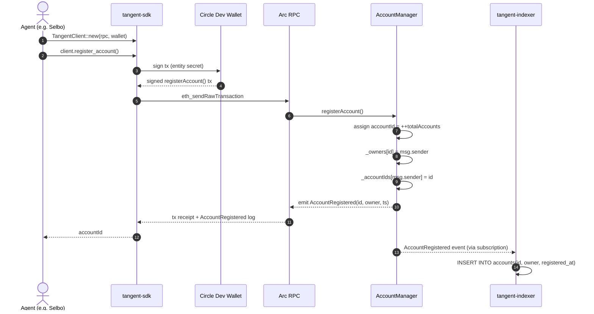
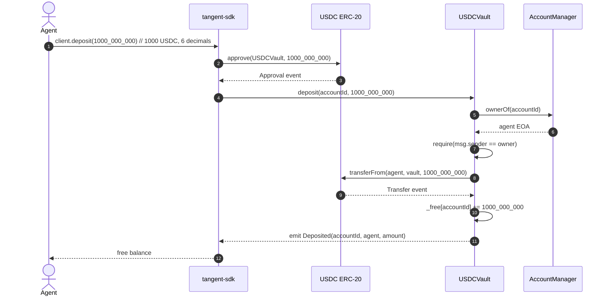
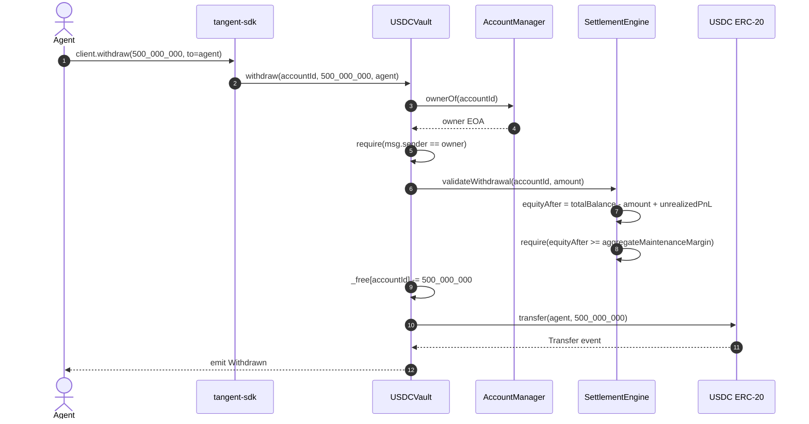
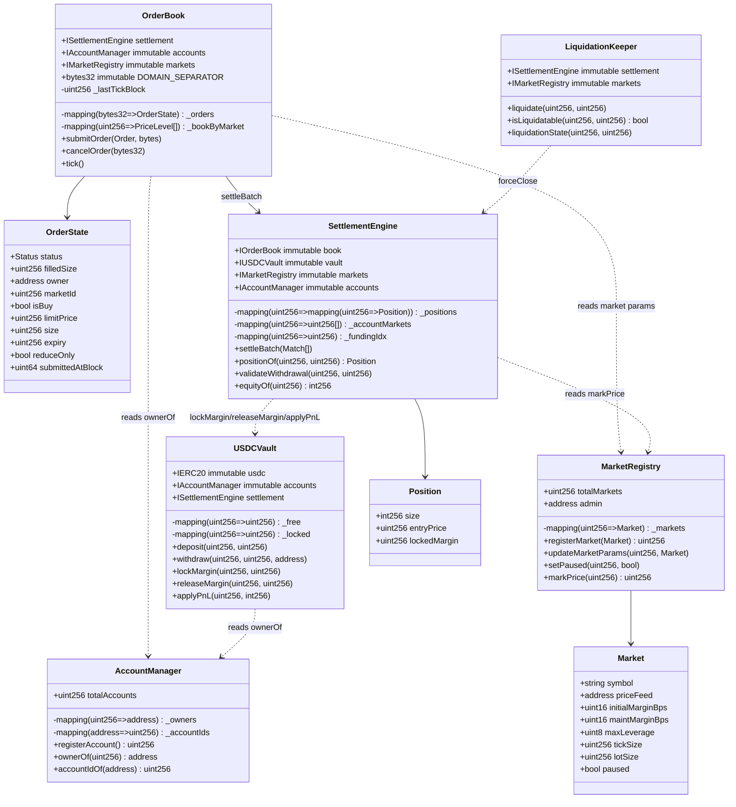
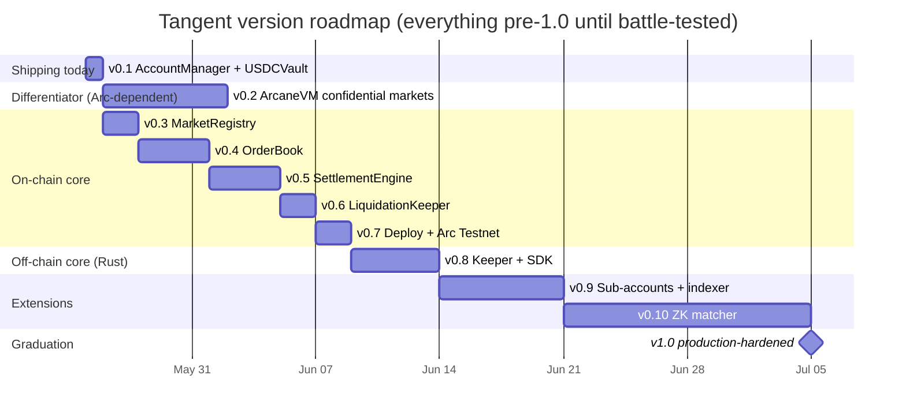

# ARCHITECTURE.md

> **Tangent**: a forkable open-source perpetual-futures DEX for Arc Testnet (Circle's EVM-compatible L1 with Malachite BFT consensus and sub-second finality).
>
> This document is the canonical architecture spec for the project. It is intentionally written ahead of full implementation so other Arc builders can read the shape of the system, fork the repo, and start building against it before v1.0 lands. Every section corresponds to a slice of code that either exists today (`v0.1`) or has a versioned landing target on the roadmap in §6.

---

## Table of contents

1. [System overview](#1-system-overview)
2. [Component-level breakdown](#2-component-level-breakdown)
3. [Sequence diagrams](#3-sequence-diagrams)
4. [Data model](#4-data-model)
5. [Trust model summary](#5-trust-model-summary)
6. [Version roadmap](#6-version-roadmap)
7. [File and module layout at v1.0](#7-file-and-module-layout-at-v10)
8. [Integration touchpoints](#8-integration-touchpoints)
9. [Trade-offs explicit](#9-trade-offs-explicit)
10. [Open questions](#10-open-questions)

---

## 1. System overview

Tangent is split deliberately along a language boundary that mirrors the trust boundary.

- **Solidity** runs on-chain. Arc enforces EVM bytecode at the consensus layer; there is no Stylus/WASM equivalent, so every contract that touches user funds or position state is Solidity.
- **Rust** runs off-chain. The keeper daemon, matcher daemon (v1.2), SDK, and indexer are all Rust crates published from a single `rust/` workspace. The language split is itself a differentiator the Arc OSS program asked for: contracts in the chain-native language, infrastructure in the systems language with the strongest ecosystem for high-throughput async services.

The diagram below shows the two layers, how data flows between them, and the integration points exposed to downstream consumers (agents like Selbo and CapitalArc that the Agora hackathon attracted).

```mermaid
flowchart TB
    subgraph Consumers["Downstream consumers"]
        SELBO["Selbo agent<br/>(autonomous perp trader)"]
        CAPARC["CapitalArc agent"]
        OTHER["Future Arc agents"]
    end

    subgraph Off["Off-chain Rust layer"]
        SDK["tangent-sdk<br/>typed-data signing, RPC client"]
        KEEPER["tangent-keeper<br/>tick() + liquidate() bot"]
        INDEXER["tangent-indexer (v1.1+)<br/>event tap → Postgres"]
        MATCHER["tangent-matcher (v1.2)<br/>ZK-proven off-chain CLOB"]
    end

    subgraph Chain["On-chain Solidity layer (Arc Testnet)"]
        AM["AccountManager"]
        MR["MarketRegistry"]
        VAULT["USDCVault"]
        OB["OrderBook"]
        SE["SettlementEngine"]
        LK["LiquidationKeeper"]
    end

    subgraph External["External integrations on Arc"]
        WALLETS["Circle Dev Wallets<br/>(entity-secret signing)"]
        ORACLE["Pyth Network on Arc<br/>(mark prices)"]
        USDC["USDC ERC-20 on Arc"]
        RPC["Arc Testnet RPC<br/>(chainId from env)"]
        SCAN["Arcscan<br/>(verification)"]
    end

    SELBO --> SDK
    CAPARC --> SDK
    OTHER --> SDK

    SDK -->|registerAccount<br/>deposit / withdraw<br/>submitOrder / cancelOrder| RPC
    SDK -.->|sign EIP-712 Order| WALLETS
    WALLETS -.->|signature| SDK

    KEEPER -->|tick() per block<br/>liquidate(underwater)| RPC
    INDEXER -->|eth_getLogs| RPC
    MATCHER -->|settleBatchWithProof v1.2| RPC

    RPC <--> AM
    RPC <--> MR
    RPC <--> VAULT
    RPC <--> OB
    RPC <--> SE
    RPC <--> LK

    OB -->|on tick| SE
    SE -->|lockMargin / releaseMargin / applyPnL| VAULT
    SE -->|markPrice / market params| MR
    SE -->|ownerOf for sig recovery| AM
    LK -->|forceClose at oracle| SE
    LK -->|markPrice| MR
    MR -->|priceFeed.read| ORACLE
    VAULT -->|transferFrom / transfer| USDC

    SE -.->|Settled events| INDEXER
    OB -.->|OrderSubmitted / Matched events| INDEXER

    Chain -.->|contract verification| SCAN
```

**What to look at in this diagram:**

- The arrow from `SDK → RPC` is the only path consumers ever touch. Everything else is internal wiring.
- `Circle Dev Wallets` sit on the signing side, never the execution side. Agents sign Orders with their dev-wallet entity secret; the signed payload travels over the SDK; the contract recovers the signer.
- `Pyth` is read-only from the contract's perspective; it is queried at settle time and at liquidation time, never written to.
- The `Off-chain Rust layer` has no settlement privilege. Every Rust component calls public contract entry points such as `submitOrder`, `cancelOrder`, and `tick`; `SettlementEngine.settleBatch` is restricted to the bound `OrderBook` so fills and order-book state stay atomic.

---

## 2. Component-level breakdown

### 2.1 On-chain Solidity contracts

#### AccountManager (`src/AccountManager.sol`, shipped in v0.1)

- **Responsibility.** Permissionless account registration. Maps `accountId ↔ EOA`. Canonical signer source for the rest of the system.
- **State held.** `totalAccounts` (monotonic counter), `_owners[id] → address`, `_accountIds[address] → id`. ~3 storage slots per account.
- **Public API.** `registerAccount() → uint256`, `ownerOf(uint256) → address`, `accountIdOf(address) → uint256`, `totalAccounts() → uint256`. Events: `AccountRegistered`, `SubAccountRegistered` (v1.1).
- **Dependencies.** None. Standalone contract, no constructor args.
- **Trust model.** Trustless. No admin keys, no upgrades, no off-chain binding. The one privileged behavior (assigning monotonic ids) is deterministic from contract state.
- **Forkability angle.** Drop-in primitive for any Arc app needing permissionless account registration without custodian binding. The interface is intentionally small (4 functions, 2 events) so forks can extend it (e.g. ENS-bound names, ERC-4337 SCAs) without breaking downstream consumers.

#### MarketRegistry (`src/MarketRegistry.sol`, v0.3 target)

- **Responsibility.** Catalogue of tradeable perp markets. Binds a base symbol to its price oracle and risk parameters.
- **State held.** `totalMarkets` counter, `_markets[id] → Market` struct (symbol, priceFeed, initialMarginBps, maintMarginBps, maxLeverage, tickSize, lotSize, maxPriceAge, paused).
- **Public API.** `registerMarket(Market)`, `updateMarketParams(id, Market)`, `setPaused(id, bool)`, `market(id) → Market`, `markPrice(id) → uint256`, `totalMarkets()`. Events: `MarketRegistered`, `MarketParamsUpdated`, `MarketPaused`.
- **Dependencies.** Oracle adapter (Pyth on Arc in v0.3; Chainlink fallback if/when available).
- **Trust model.** Admin-controlled in v0.1–v1.0 (governance multisig curates markets and risk params). Permissionless with bond + slashing in v1.1.
- **Forkability angle.** Pluggable oracle adapter, fork to swap Pyth for any feed that satisfies the `markPrice(uint256) → uint256` shape. Risk params are stored per-market so a fork can run conservative markets next to aggressive ones in the same contract.

#### USDCVault (`src/USDCVault.sol`, v0.2 target)

- **Responsibility.** Per-account USDC collateral vault. Tracks free balance, locked margin, and applies realized PnL. The only contract that holds user funds.
- **State held.** `_free[accountId] → uint256`, `_locked[accountId] → uint256`. Two slots per funded account.
- **Public API.** User-facing: `deposit(accountId, amount)`, `withdraw(accountId, amount, to)`, `freeBalanceOf`, `lockedBalanceOf`, `totalBalanceOf`. Settlement-engine hooks (access-gated by deploy-time binding): `lockMargin`, `releaseMargin`, `applyPnL(int256)`. Bound withdrawals call `SettlementEngine.validateWithdrawal` before funds leave. Events: `Deposited`, `Withdrawn`, `MarginLocked`, `MarginReleased`, `PnLApplied`.
- **Dependencies.** USDC ERC-20 contract on Arc (immutable address bound at construction). `AccountManager` for ownership checks on `withdraw`. `SettlementEngine` bound once by the immutable `settlementBinder` via `bindSettlementEngine` (one-shot, no admin upgrade path after binding).
- **Trust model.** Trustless for deposit and balance reads. Keeper-dependent indirectly (margin can only be released by `SettlementEngine`, which fires from `tick()`). Withdrawal is owner-authorized via `AccountManager.ownerOf`.
- **Forkability angle.** Self-contained ERC-20 vault. Forks can swap the collateral token (USDC → USDT, eUSD, etc) by changing one immutable constructor arg. The `lockMargin / releaseMargin / applyPnL` triad is reusable for any leveraged product, not just perps.

#### OrderBook (`src/OrderBook.sol`, shipped locally in v0.4/v0.5)

- **Responsibility.** On-chain CLOB with deterministic batched matching. Receives EIP-712 signed orders, accumulates them in contract state, walks the book on `tick()`, emits `Matched` events, hands match set to `SettlementEngine`.
- **State held.** `_orders[orderHash] → RestingOrder {order, remaining, sequence, exists, live}` plus an append-only order hash log and a bounded `liveOrderCount` cap. v0.4 uses a bounded scanner for simplicity; the production target remains per-market price-level FIFO queues.
- **Public API.** `submitOrder(Order, signature)`, `cancelOrder(orderHash)`, `tick()`, `isLive(orderHash) → bool`, `orderOf(orderHash) → (Order, exists)`, `bindSettlementEngine(engine)`. Events: `OrderSubmitted`, `OrderCancelled`, `Matched`.
- **Dependencies.** `AccountManager` (signer recovery via `ownerOf`), `MarketRegistry` (tick/lot validation, paused check), `SettlementEngine` (one-shot-bound handoff). EIP-712 domain `"Tangent v1"` (see `src/types/OrderTypes.sol`).
- **Trust model.** Trustless for submit and cancel. Keeper-dependent for tick latency (anyone can tick once SettlementEngine is bound, but a keeper is expected to call regularly). The matching algorithm is deterministic price-time priority, but because `tick()` is still a normal EVM transaction, ADR 0001's end-of-block MEV claim is an architectural target rather than a property fully enforced by v0.4 alone.
- **Forkability angle.** The matching engine is reusable for any orderbook market on Arc (spot, options, prediction markets), not just perps. The deterministic batched-settlement pattern is generalizable to high-MEV-risk venues. EIP-712 domain is the only Arc-perp-specific binding.

#### SettlementEngine (`src/SettlementEngine.sol`, shipped locally in v0.5)

- **Responsibility.** Minimal matched-order settlement. Validates book-produced matches, mutates per-account/per-market positions, locks/releases per-position initial margin through `USDCVault`, applies realized PnL, validates aggregate account maintenance health, enforces reduce-only, and emits `Settled` / `PositionUpdated`.
- **State held.** `_positions[accountId][marketId] → Position {size (int256, signed), entryPrice, lockedMargin}` plus per-account touched-market lists used for aggregate maintenance checks.
- **Public API.** `settleBatch(Match[])` callable only by the bound `OrderBook`; `positionOf(accountId, marketId) → Position`; `validateWithdrawal(accountId, amount)`.
- **Dependencies.** `OrderBook` (trusted match producer + order metadata), `USDCVault` (lockMargin / releaseMargin / applyPnL), `MarketRegistry` (risk params and pause defense).
- **Trust model.** Permissionless at the system level through public `OrderBook.tick()`. Direct arbitrary `settleBatch` is intentionally not supported in v0.5 because it would need a richer proof or book-state mutation path to avoid fill/book drift.
- **Forkability angle.** The position-accounting + account-margin core is reusable for other leveraged products. Funding, richer portfolio margin, and direct proof-based settlement remain additive future layers.

#### LiquidationKeeper (`src/LiquidationKeeper.sol`, shipped locally in v0.6)

- **Responsibility.** Permissionless liquidation entry point. Anyone can call `liquidate(accountId, marketId)` against an underwater position; the contract validates underwater-ness against account collateral equity plus unrealized PnL, then force-closes the full position at mark price.
- **State held.** No persistent per-account liquidation state. Validation re-derives from `SettlementEngine.positionOf` and `MarketRegistry.markPrice` on each call.
- **Public API.** `liquidate(accountId, marketId)`, `isLiquidatable(accountId, marketId) → bool`, `liquidationState(accountId, marketId) → (liquidatable, equity, maintenanceMargin)`. Events: `Liquidated`.
- **Dependencies.** `SettlementEngine` (forced position close + PnL apply), `MarketRegistry` (mark price + maintMarginBps), `USDCVault` (account collateral balance).
- **Trust model.** Trustless. Invalid liquidation calls revert. No `LIQUIDATION_ROLE`; anyone can close an underwater position. Liquidator bounty payout is intentionally deferred until the vault has a minimal, auditable payout hook.
- **Forkability angle.** The close-at-mark pattern is reusable for any account-margin leveraged product. Bounty economics and insurance-fund routing can be added without changing the basic liquidation predicate.

### 2.2 Off-chain Rust components

#### tangent-keeper (v1.0 target, `rust/tangent-keeper/`)

- **Responsibility.** Single binary that wakes on every Arc block, calls `OrderBook.tick()`, scans for underwater positions, and calls `LiquidationKeeper.liquidate()` where profitable.
- **Runtime state.** Block subscriber via `eth_subscribe("newHeads")`, in-memory copy of open positions (rebuilt from `Settled` event tail on startup), gas-price oracle.
- **Public API surface.** CLI (`tangent-keeper run --rpc <url> --key <signing-key>`), metrics endpoint (`/metrics` Prometheus), structured logs (tracing-subscriber JSON).
- **Dependencies.** `alloy` (Arc-compatible web3 client), `tokio`, `tracing`, `prometheus`. Uses the same `tangent-sdk` crate as agents for typed-data contract bindings.
- **Trust model.** Keeper-dependent for liveness, not for correctness. If the keeper goes down, any trader can call `tick()` themselves; matches just sit in the book one extra block.
- **Forkability angle.** Single-binary, single-config-file shape so any builder can `cargo run --release` and have a live keeper. The crate is split into `keeper-core` (logic) and `keeper-bin` (entry point) so forks can wrap the core into custom service shapes (k8s pod, AWS Lambda, etc.).

#### tangent-sdk (v1.0 target, `rust/tangent-sdk/`)

- **Responsibility.** Typed-data signing + RPC client for agents. The single dependency a downstream agent like Selbo needs to integrate against arc-perp-reference.
- **Runtime state.** Stateless. Holds RPC client config and EIP-712 domain hash; everything else is per-call.
- **Public API surface.** Async Rust API: `TangentClient::new(rpc, account, signer)`, `client.register_account()`, `client.deposit(amount)`, `client.submit_order(OrderParams)`, `client.cancel_order(hash)`, `client.withdraw(amount, to)`, `client.position(market) → Position`, `client.equity() → I256`. Re-exports the EIP-712 `Order` struct and `domain_separator()` helper for advanced users.
- **Dependencies.** `alloy` for RPC + ABI, `alloy-signer-aws` and `alloy-signer-local` for signing backends, `serde` for the Order struct. Optional `circle-dev-wallets` feature flag for entity-secret signing (calls Circle's REST API to sign).
- **Trust model.** Trustless. The SDK is a thin client; every operation is a public on-chain call. The SDK never holds user funds.
- **Forkability angle.** First-class Rust crate published to crates.io. TypeScript SDK is intentionally deferred to a separate repo so the canonical reference stays single-language per side of the boundary.

#### tangent-matcher (v1.2 target, `rust/tangent-matcher/`)

- **Responsibility.** Off-chain orderbook with ZK proof generation. Lighter-style: matches orders off-chain at much higher throughput than on-chain `tick()` can sustain, generates a SNARK proving the match set is correct against the on-chain book state, submits proof + matches to `SettlementEngineV2.settleBatchWithProof()`.
- **Runtime state.** Full in-memory CLOB per market (price-time-priority queues), proof prover (likely `risc0` or `sp1`).
- **Public API surface.** gRPC for order ingestion (mirrors `OrderBook.submitOrder` shape), batch submission to chain via the SDK.
- **Dependencies.** `tangent-sdk`, ZK proving stack TBD at v1.2 spec time.
- **Trust model.** Trustless given a valid proof. The on-chain verifier rejects any settlement whose proof does not match the committed book state. Multiple matchers can run in parallel; the first valid proof per block wins.
- **Forkability angle.** Optional component. Tangent at v1.0 already works without the matcher. The matcher is an opt-in scaling layer for forks that outgrow on-chain matching.

#### tangent-indexer (v1.1 target, `rust/tangent-indexer/`)

- **Responsibility.** Event tap that mirrors on-chain state into a Postgres database optimized for analytics and frontend queries (orderbook depth, fills feed, trader positions, PnL history).
- **Runtime state.** Last-indexed block cursor, in-memory de-duplication buffer for reorg safety (Malachite BFT removes reorg risk but the indexer keeps a small confirmation buffer anyway).
- **Public API surface.** GraphQL endpoint (`async-graphql`), REST endpoints for orderbook snapshots, WebSocket subscription for live fills.
- **Dependencies.** `alloy` for event subscription, `sqlx` for Postgres, `async-graphql`. Optional Redis cache for hot reads.
- **Trust model.** Trustless. The indexer reads only public events; corrupting its database does not affect contract state. Multiple independent indexers can run in parallel and disagreement is detectable by comparing GraphQL responses.
- **Forkability angle.** Schema migrations under `sqlx-cli` so any fork can `cargo sqlx migrate run` to bootstrap a fresh indexer DB. The GraphQL schema is exposed under `rust/tangent-indexer/schema.graphql` for frontend codegen.

---

## 3. Sequence diagrams

### 3.1 Account onboarding



**What to look at:** the path is one RPC round-trip and one contract write. No off-chain provisioning, no Fireblocks callback, no allowlist check. The indexer reads the event independently for analytics; it does not gate registration.

### 3.2 Deposit collateral



**What to look at:** two transactions (approve, deposit), the standard ERC-20 pattern. The vault enforces that the depositor owns the account being credited. No vault privileges for the depositor; it is a one-way transfer into the per-account ledger.

### 3.3 Trade open: happy path

```mermaid
sequenceDiagram
    autonumber
    actor Agent
    participant SDK as tangent-sdk
    participant Wallet as Circle Dev Wallet
    participant OB as OrderBook
    participant K as tangent-keeper
    participant SE as SettlementEngine
    participant V as USDCVault
    participant MR as MarketRegistry
    participant AM as AccountManager

    Agent->>SDK: client.submit_order(market=BTC, isBuy=true, size=1e18, limitPrice=...)
    SDK->>SDK: build Order struct, hash via EIP-712 domain "Tangent v1"
    SDK->>Wallet: sign digest
    Wallet-->>SDK: signature
    SDK->>OB: submitOrder(order, signature)
    OB->>AM: ownerOf(order.accountId)
    AM-->>OB: owner EOA
    OB->>OB: ecrecover(digest, sig) == owner
    OB->>MR: market(order.marketId) // pause + tick/lot check
    MR-->>OB: Market{paused=false, ...}
    OB->>OB: _orders[hash] = OrderState{status: Live, ...}
    OB-->>Agent: emit OrderSubmitted

    Note over OB,K: Order rests in book until tick()

    K->>OB: tick() (next block boundary)
    OB->>OB: walk price-time priority queues
    OB->>OB: produce Match[] (best bid lifts best ask)
    OB-->>K: emit Matched per fill
    OB->>SE: settleBatch(matches) [internal call]
    loop per match
        SE->>SE: validate orderHash within settlement window
        SE->>MR: markPrice(marketId)
        MR-->>SE: P_mark
        SE->>SE: compute initialMargin = size * P_mark * initialMarginBps / 10000
        SE->>V: lockMargin(buyAccountId, initialMargin)
        V->>V: _free -= amt; _locked += amt
        SE->>V: lockMargin(sellAccountId, initialMargin)
        SE->>SE: _positions[buyAcct][market] += signed size
        SE->>SE: _positions[sellAcct][market] -= signed size
        SE-->>K: emit Settled
    end
```

**What to look at:** the order submission step never settles. Matching is deferred to `tick()`, which the keeper calls every block. The whole settle pass is atomic, and any failed margin check reverts the entire batch (per ADR 0001).

### 3.4 Trade close

```mermaid
sequenceDiagram
    autonumber
    actor Agent
    participant SDK as tangent-sdk
    participant OB as OrderBook
    participant K as tangent-keeper
    participant SE as SettlementEngine
    participant V as USDCVault
    participant MR as MarketRegistry

    Agent->>SDK: client.submit_order(market=BTC, isBuy=false, size=1e18, reduceOnly=true)
    SDK->>OB: submitOrder(order, signature)
    OB-->>Agent: emit OrderSubmitted

    K->>OB: tick()
    OB->>SE: settleBatch(matches)
    loop per match
        SE->>SE: check reduceOnly: |new pos| < |old pos|
        SE->>MR: markPrice
        MR-->>SE: P_close
        SE->>SE: realizedPnL = (P_close - entryPrice) * closedSize * (long?+1:-1)
        SE->>V: releaseMargin(accountId, marginFreed)
        V->>V: _locked -= amt; _free += amt
        SE->>V: applyPnL(accountId, realizedPnL)
        alt PnL positive
            V->>V: _free += pnl
            V-->>SE: emit PnLApplied(+)
        else PnL negative
            V->>V: _free = max(_free + pnl, 0)
            V-->>SE: emit PnLApplied(-)
        end
        SE->>SE: _positions[acct][market] -= signed size
        SE-->>K: emit Settled
    end
```

**What to look at:** close is the inverse of open. `releaseMargin` returns initial margin to the free balance; `applyPnL` then adds or subtracts realized profit. A negative-PnL close that drives `_free` to zero is the first signal the account is heading toward liquidation.

### 3.5 Liquidation

```mermaid
sequenceDiagram
    autonumber
    participant K as tangent-keeper
    participant LK as LiquidationKeeper
    participant SE as SettlementEngine
    participant MR as MarketRegistry
    participant V as USDCVault
    participant LIQ as Liquidator EOA

    K->>LK: liquidationState(accountId, marketId)
    LK-->>K: liquidatable, equity, maintenanceMargin
    K->>LK: liquidate(accountId, marketId) [from LIQ EOA]
    LK->>SE: positionOf(accountId, marketId)
    SE-->>LK: position
    LK->>MR: markPrice(marketId)
    MR-->>LK: P_mark
    LK->>LK: recompute equity at P_mark; require < maintMargin
    LK->>SE: forceClose(accountId, marketId, P_mark)
    SE->>SE: closedSize = |position|
    SE->>SE: realizedPnL = (P_mark - entryPrice) * closedSize * sign
    SE->>V: releaseMargin(accountId, lockedMargin)
    SE->>V: applyPnL(accountId, realizedPnL) // negative
    SE->>SE: _positions[acct][market] = 0
    SE-->>LK: pnl
    LK-->>LIQ: emit Liquidated(accountId, marketId, liquidator, markPrice, pnl)
```

**What to look at:** `LiquidationKeeper` is the only contract that ever invokes a forced close. The v0.6 entry point is fully permissionless but does not yet pay a liquidator bounty; bounty economics need a dedicated vault payout hook and insurance-fund policy.

### 3.6 Withdrawal



**What to look at:** the vault asks `SettlementEngine` to validate the post-withdrawal account state before allowing the transfer. If the withdrawal would drop account equity below aggregate maintenance margin across open positions, the call reverts. This is the only on-chain check; there is no off-chain withdrawal approval.

---

## 4. Data model

### 4.1 Storage layout per contract



### 4.2 Per-account state shape

| Field | Type | Source contract | Purpose |
|---|---|---|---|
| `accountId` | `uint256` | AccountManager | Stable identifier; monotonic from 1 |
| `owner` | `address` | AccountManager | Canonical signer source |
| `freeBalance` | `uint256` (USDC, 6 dec) | USDCVault | Withdrawable + available for new orders |
| `lockedBalance` | `uint256` | USDCVault | Initial margin against open positions |
| `position[marketId]` | `Position` | SettlementEngine | Signed size + entry price + locked margin |
| `nonce` (per-order) | `uint256` | OrderBook (in Order struct) | Per-account monotonic; consumed on settle |

### 4.3 Per-market state shape

| Field | Type | Notes |
|---|---|---|
| `symbol` | `string` | e.g. "BTC", "ETH", "SOL" |
| `priceFeed` | `address` | Oracle adapter on Arc; queried at settlement health + liquidation time |
| `maxPriceAge` | `uint32` | Maximum accepted oracle age in seconds |
| `initialMarginBps` | `uint16` | e.g. 1000 = 10% (10x max leverage at entry) |
| `maintMarginBps` | `uint16` | e.g. 500 = 5%; below this → liquidatable |
| `maxLeverage` | `uint8` | Human-readable leverage cap; registry requires `initialMarginBps` to be high enough for this cap |
| `tickSize` | `uint256` | Minimum price increment, in `PRICE_SCALE` (1e8) |
| `lotSize` | `uint256` | Minimum size increment, in 1e18 base units |
| `paused` | `bool` | Halts new orders; close-only mode |

### 4.4 Per-order state shape

| Field | Type | Lifecycle |
|---|---|---|
| `status` | `enum {Live, Cancelled, Filled, Expired}` | Live → terminal on first cancel/fill/expiry-sweep |
| `filledSize` | `uint256` | Cumulative partial fills; `filledSize == size` ⇒ `Filled` |
| `owner` | `address` | Cached from `AccountManager.ownerOf(accountId)` at submit |
| `submittedAtBlock` | `uint64` | For settlement-window enforcement |
| (the rest of `Order` fields) | per OrderTypes.sol | Stored verbatim for `tick()` matching |

---

## 5. Trust model summary

| Component | Trust category | Rationale |
|---|---|---|
| **AccountManager** | Trustless | No admin, no upgrade, deterministic state transitions. Worst case: spam registrations (bounded by gas cost) |
| **MarketRegistry** | Admin-controlled (v0.1–v1.0) → Trustless with bond (v1.1) | Risk-param curation is too high-stakes for fully permissionless launch; bonded permissionless model lands once governance mechanics are spec'd |
| **USDCVault** | Trustless (deposit, withdraw, reads) + bound-callee gated (margin hooks) | Only the `SettlementEngine` chosen by the immutable one-shot binder can mutate locked balance; withdrawal is owner-authorized and maintenance-checked once settlement is bound |
| **OrderBook** | Trustless | Submit, cancel, tick are all permissionless. Matching algorithm is deterministic price-time priority |
| **SettlementEngine** | Bound-book settlement | Anyone can call `OrderBook.tick()`, but only the bound book can call `settleBatch`. Atomic-revert on any invalid fill keeps settlement and book state in sync |
| **LiquidationKeeper** | Trustless + economic-incentive | Underwater check re-derives from oracle on every call. Bounty funds keepers; invalid-call asymmetry funds correctness |
| **Pyth oracle adapter** | Oracle-trusted | Pyth attestor set + Arc's view of price-update VAA is the trust root. Standard for any oracle-dependent perp protocol |
| **tangent-keeper** | Keeper-dependent (liveness only) | If down, traders self-tick. Cannot censor orders (anyone can call `tick()` in the same block) |
| **tangent-sdk** | Trustless | Thin client; never holds funds; never has special contract privileges |
| **tangent-matcher (v1.2)** | Trustless given valid proof | ZK proof against on-chain book state. Invalid proofs revert on `settleBatchWithProof` |
| **tangent-indexer** | Trustless (read-only) | Wrong indexer state never affects contracts. Multi-instance disagreement is publicly detectable |

---

## 6. Version roadmap

The roadmap is deliberately sliced so each version is independently mergeable, deployable, and forkable. No version requires the next to be useful.

| Version | Scope | Depends on | Est. LOC (delta) | Risk / complexity |
|---|---|---|---|---|
> **A note on version labels.** Every release on this roadmap is labeled `v0.x`, never `v1.x` or higher. We reserve `v1.0` for the day this implementation has been battle-tested in production on Arc with real users and a stable API surface. Until then everything is pre-1.0, including features we've fully shipped. Labeling something `v1.0` because we built it inverts the meaning of semver; `v1.0` is earned by use, not declared by intent. This is the same discipline the Linux kernel ran on for years.

| Version | Scope | Depends on | Est. LOC (delta) | Risk / complexity |
|---|---|---|---|---|
| **v0.1** *(live deployment)* | Interfaces + `OrderTypes` library + `AccountManager` impl + `USDCVault` impl (deposit/withdraw + margin-hook scaffold + handler-driven invariant fuzz) + `MarketRegistry` impl with admin curation + pluggable `IPriceFeed` adapter (MockPriceFeed for tests; production Arc oracle adapter deferred) + deploy wiring for the three primitive contracts + ADRs 0001/0002/0003 + focused unit/fuzz tests + EIP-712 frozen-typehash tests + end-to-end integration test (register-market → register-account → deposit → mark-price-read → withdraw) | none | ~1,600 Sol + 1,300 test | Low. Three primitives, all production-shaped |
| **v0.2: Confidential markets via ArcaneVM** | Once Arc enables [ArcaneVM](https://docs.arc.io/arc/concepts/execution-layer) (the confidential execution environment alongside Arc's public EVM), add an opt-in per-market flag for confidential trading where order book state, positions, and PnL are private. Natural fit for institutional traders who need position privacy without leaving Arc. Positioned at v0.2 to signal it's our highest-priority future milestone, not strict implementation order; ships whenever Arc protocol enables ArcaneVM. | ArcaneVM availability on Arc | TBD | Med. Gated on Arc protocol; design work happens in parallel with v0.3–v0.7 implementation |
| **v0.3: PythPriceFeed adapter + permissionless market discovery hooks** | `PythPriceFeed.sol` adapter conforming to `IPriceFeed` and wrapping Pyth on Arc Testnet, plus event-rich market-listing hooks for the v0.9 permissionless-market path. (MarketRegistry itself already shipped in v0.1; v0.3 fills in the production oracle adapter and the discovery side of the registry.) | v0.1 | ~200 Sol + 200 test | Low. Pyth wrapping is the only unknown |
| **v0.4: OrderBook** | EIP-712 sig verification, bounded in-memory CLOB scanner, submitOrder / cancelOrder / tick, mandatory settlement-engine handoff, unit tests | v0.1, v0.3 | ~700 Sol + 600 test | Med–High. The matching-engine bug surface is the hardest part of the whole system |
| **v0.5: SettlementEngine** | Bound-book settlement, per-market position accounting, initial-margin lock/release, aggregate account margin health, realized PnL, withdrawal health validation, reduce-only enforcement, atomic batch revert, integration tests against v0.4 | v0.1, v0.3, v0.4 | ~600 Sol + 700 test | High. The interaction surface with OrderBook + USDCVault is where economic bugs live |
| **v0.6: LiquidationKeeper** | Permissionless liquidate(), account-collateral health check, mark-price forced close through SettlementEngine, tests for healthy/no-position/underwater paths | v0.1, v0.3, v0.5 | ~250 Sol + 300 test | Med. Logic is small but adversarial; needs heavy fuzzing |
| **v0.7: Deploy + Arc Testnet** | Full Deploy.s.sol with the full contract wiring order from §7, deployment manifest emission, Arcscan verification, end-to-end shadow trade against real Arc Testnet RPC | v0.1, v0.3–v0.6 | ~200 Sol + ops docs | Med. First touch with Arc Testnet; expect oracle/feed integration drift |
| **v0.8: Keeper + Rust SDK** | `rust/tangent-keeper` daemon (tick + liquidate), `rust/tangent-sdk` crate (typed-data signing, RPC client, Circle Dev Wallet integration), Rust CI, crates.io publish | v0.7 | ~2,500 Rust + tests | Med. New language surface; expect alloy ABI codegen friction |
| **v0.9: Sub-accounts + permissionless markets + indexer** | AccountManager sub-account derivation, MarketRegistry permissionless registration with bond + slashing, `rust/tangent-indexer` daemon with Postgres + GraphQL | v0.8 | ~400 Sol + 1,500 Rust | Med–High. Permissionless markets need governance mechanics |
| **v0.10: ZK-matched orderbook** | `rust/tangent-matcher` with proof generation, `SettlementEngineV2.settleBatchWithProof()` on-chain verifier, opt-in per-market flag for matcher-mode vs on-chain tick-mode | v0.9 | ~800 Sol + 4,000 Rust | High. ZK stack (sp1/risc0) integration is the deepest unknown in the roadmap |
| **v1.0: Production-hardened** | Earned, not declared. Promoted to `v1.0` after the system has been deployed and used on Arc Testnet (or eventually mainnet) for long enough to demonstrate stability: zero unresolved critical bugs across the contract suite, a meaningful number of accounts onboarded by external builders, the API surface stable across at least one full development cycle, and a security review (formal or community) on the high-risk contracts (OrderBook, SettlementEngine, LiquidationKeeper). | All prior | none | This is the bar for graduating out of v0.x, not a feature scope |



---

## 7. File and module layout at v0.10 (the pre-1.0 ceiling)

```
arc-perp-reference/
├── README.md                             # high-level intro (shipped)
├── ARCHITECTURE.md                       # this document
├── LICENSE                               # MIT
├── foundry.toml                          # Solidity build config (shipped)
├── .gitignore
│
├── src/                                  # Solidity contracts
│   ├── AccountManager.sol                # v0.1 shipped
│   ├── USDCVault.sol                     # v0.1 shipping today
│   ├── MarketRegistry.sol                # v0.3
│   ├── OrderBook.sol                     # v0.4
│   ├── SettlementEngine.sol              # v0.5
│   ├── LiquidationKeeper.sol             # v0.6
│   ├── interfaces/                       # v0.1 shipped
│   │   ├── IAccountManager.sol
│   │   ├── IUSDCVault.sol
│   │   ├── IMarketRegistry.sol
│   │   ├── IOrderBook.sol
│   │   └── ISettlement.sol
│   ├── types/
│   │   └── OrderTypes.sol                # v0.1 shipped
│   ├── adapters/
│   │   └── PythOracleAdapter.sol         # v0.3
│   └── confidential/
│       └── ConfidentialMarket.sol        # v0.2 (ArcaneVM-gated)
│
├── test/                                 # Foundry tests
│   ├── AccountManager.t.sol              # v0.1 shipped
│   ├── USDCVault.t.sol                   # v0.1 shipping today
│   ├── MarketRegistry.t.sol              # v0.3
│   ├── OrderBook.t.sol                   # v0.4
│   ├── SettlementEngine.t.sol            # v0.5
│   ├── LiquidationKeeper.t.sol           # v0.6
│   ├── integration/
│   │   ├── DepositWithdrawRoundtrip.t.sol  # v0.1 shipping today
│   │   ├── HappyPathTrade.t.sol          # v0.6
│   │   ├── LiquidationFlow.t.sol         # v0.6
│   │   └── EndToEndAgent.t.sol           # v0.7
│   └── invariant/
│       ├── MarginInvariants.t.sol        # v0.5
│       └── VaultInvariants.t.sol         # v0.1 shipping today
│
├── script/
│   ├── Deploy.s.sol                      # v0.1 (AccountManager+USDCVault) → v0.7 full wiring
│   └── RegisterMarkets.s.sol             # v0.7
│
├── docs/
│   ├── adr/
│   │   ├── 0001-batched-end-of-block-settlement.md   # shipped
│   │   ├── 0002-permissionless-account-onboarding.md # shipped
│   │   ├── 0003-pyth-oracle-adapter.md               # v0.3
│   │   ├── 0004-funding-rate-on-chain-twap.md        # v0.5
│   │   ├── 0005-liquidation-bounty-economics.md      # v0.6
│   │   ├── 0006-rust-workspace-split.md              # v0.8
│   │   └── 0007-arcanevm-confidential-markets.md     # v0.2 (design before code, since ArcaneVM is Arc-gated)
│   ├── deployments/
│   │   └── arc-testnet.json              # v0.7 (addresses + domainSeparator)
│   └── integration/
│       └── selbo-migration-guide.md      # v0.8
│
├── rust/                                 # Rust workspace
│   ├── Cargo.toml                        # workspace manifest
│   ├── rust-toolchain.toml               # pinned stable
│   ├── tangent-sdk/                     # v1.0
│   │   ├── Cargo.toml
│   │   ├── src/
│   │   │   ├── lib.rs
│   │   │   ├── client.rs                 # TangentClient
│   │   │   ├── order.rs                  # EIP-712 Order + signing
│   │   │   ├── domain.rs                 # domain separator helper
│   │   │   ├── circle_wallet.rs          # entity-secret signer (feature-flagged)
│   │   │   └── abi/                      # alloy-generated bindings
│   │   ├── tests/
│   │   └── examples/
│   │       └── place_order.rs
│   ├── tangent-keeper/                  # v1.0
│   │   ├── Cargo.toml
│   │   ├── src/
│   │   │   ├── main.rs
│   │   │   ├── tick_loop.rs
│   │   │   ├── liquidation_scan.rs
│   │   │   ├── metrics.rs
│   │   │   └── config.rs
│   │   └── tests/
│   ├── tangent-indexer/                 # v1.1
│   │   ├── Cargo.toml
│   │   ├── migrations/                   # sqlx
│   │   ├── schema.graphql
│   │   └── src/
│   │       ├── main.rs
│   │       ├── ingest.rs
│   │       ├── graphql.rs
│   │       └── api.rs
│   └── tangent-matcher/                 # v1.2
│       ├── Cargo.toml
│       └── src/
│           ├── main.rs
│           ├── orderbook.rs
│           └── prover.rs
│
└── .github/
    └── workflows/
        ├── solidity.yml                  # forge build + test + fmt + slither
        ├── rust.yml                      # cargo fmt + clippy + test + sqlx prepare
        ├── coverage.yml                  # forge coverage + cargo-llvm-cov
        └── release.yml                   # crates.io + Foundry deployment artifact upload
```

---

## 8. Integration touchpoints

### 8.1 Pyth Network on Arc Testnet

- **Role.** Mark price source for `MarketRegistry.markPrice(marketId)` and for `LiquidationKeeper.isLiquidatable`.
- **Integration shape.** `PythOracleAdapter.sol` wraps the Pyth proxy contract on Arc. Each `Market.priceFeed` stores a Pyth `bytes32` feed ID (BTC/USD = `0xe62df...`, ETH/USD = `0xff61491...`, etc.); the adapter resolves to a price by calling `pyth.getPriceUnsafe(feedId)` and normalizes to `PRICE_SCALE = 1e8`.
- **Price-update semantics.** Pyth requires a fresh `updatePriceFeeds(updateData)` call to commit a new price on-chain. The keeper bot includes the Pyth VAA update in the same transaction as `tick()` or `liquidate()` when the stored price is staler than the market's `maxPriceAge`.
- **Failure mode.** `MarketRegistry.markPrice()` rejects zero, future-dated, or stale oracle responses. Stale-price reverts force the caller to bundle a fresh oracle update or wait. No silent stale reads.

### 8.2 USDC on Arc

- **Token.** Canonical USDC ERC-20 on Arc Testnet. Address bound into `USDCVault` at construction as `immutable IERC20 usdc`.
- **Decimals.** 6. All vault math is in 6-decimal USDC units. The Order struct uses separate price (`1e8`) and size (`1e18`) scales; conversions happen in `SettlementEngine` at margin-computation time.
- **Approval pattern.** Standard `approve` → `deposit`. The SDK exposes a `deposit_with_permit()` convenience for EIP-2612 if/when Arc USDC adds permit support.

### 8.3 Circle Developer-Controlled Wallets

- **Role.** Signing backend for autonomous agents that don't hold raw private keys. Each agent provisions a Dev Wallet, signs the entity-secret cipher once at startup, and uses the wallet to sign each Order's EIP-712 digest.
- **Integration shape.** Optional `circle-dev-wallets` feature in `tangent-sdk`. When enabled, `TangentClient::new_with_circle_wallet(rpc, wallet_id, entity_secret)` returns a client whose `submit_order` builds the EIP-712 digest locally and forwards it to Circle's REST signing API. The signed payload is verified locally before submission.
- **Why it matters.** Selbo and CapitalArc both use this pattern. The reference SDK supporting it natively means an agent migration from Hyperliquid back to Arc is a configuration change, not a signing-stack rewrite.

### 8.4 Arc Testnet RPC

- **Endpoint.** Bound via `ARC_RPC` env var; no hardcoded URL in the repo. Foundry consumes via `foundry.toml`'s `[rpc_endpoints]` block (already shipped).
- **Chain ID.** Not hardcoded. `Deploy.s.sol` reads `block.chainid` at construction and bakes it into the EIP-712 `DOMAIN_SEPARATOR`. Any consumer that wants to pre-compute the domain separator off-chain reads the chainId from the deployment manifest at `docs/deployments/arc-testnet.json`.
- **Tx flow.** All on-chain writes use standard `eth_sendRawTransaction`. The keeper uses `eth_subscribe("newHeads")` for block notifications; the indexer uses `eth_getLogs` with a per-cycle cursor.

### 8.5 Arcscan

- **Verification.** Foundry's `--verify` flag is wired against the `arc_testnet` Etherscan endpoint defined in `foundry.toml` (shipped). Each contract auto-verifies on deploy when `ARCSCAN_API_KEY` is set.
- **Manifest.** `script/Deploy.s.sol` writes a JSON manifest into `broadcast/Deploy.s.sol/<chainid>/run-latest.json`; the v0.7 deploy script copies the resolved addresses + `DOMAIN_SEPARATOR` into `docs/deployments/arc-testnet.json` so downstream consumers can pin against a stable, committed file.

---

## 9. Trade-offs explicit

For each major architectural decision, the alternative considered and why it was rejected.

### 9.1 Batched matching vs continuous matching

See [ADR 0001](./docs/adr/0001-batched-end-of-block-settlement.md). One-line summary: continuous matching's MEV surface is unacceptable on a leveraged-positions venue; batched matching narrows the sandwiching surface and is the target path for protocol-enforced end-of-block execution, at the cost of ~1 block (~1s) of additional latency.

### 9.2 Permissionless EOA vs Fireblocks-custodied accounts

See [ADR 0002](./docs/adr/0002-permissionless-account-onboarding.md). One-line summary: Fireblocks-binding blocks autonomous agent onboarding, which is the entire reason this reference exists. Permissionless EOA registration is the primitive that breaks Shapeshifter's custody gate.

### 9.3 On-chain CLOB vs off-chain matcher with ZK proofs

**Chosen (v0.4–v1.0):** on-chain CLOB with deterministic batched matching.
**Deferred (v1.2):** Lighter-style off-chain matcher with ZK proofs against on-chain book state.

**Rationale for the split:**
- On-chain CLOB has zero off-chain trust dependencies and is fully transparent. It is the right *reference* implementation: a builder reading the code can see exactly how every match happens.
- ZK-proven off-chain matching is the right *production-scaling* path once book depth exceeds what on-chain `tick()` can sustain in a single block. The proving stack (sp1/risc0 + a custom matcher circuit) is non-trivial infrastructure and adds a class of cryptography bugs that distracts from the v1.0 educational goal.
- The two are compositionally compatible: `SettlementEngineV2.settleBatchWithProof` is purely additive next to `settleBatch`. A per-market flag picks which path is active. v1.2 does not deprecate v1.0.

### 9.4 Solidity vs Rust for contracts

**Chosen:** Solidity for everything on-chain.
**Rejected:** Rust contracts via Stylus.

**Rationale:** Arc has no Stylus equivalent. The Arc execution layer requires EVM bytecode. Rust-on-chain is not a deployment target on Arc Testnet today. The language split therefore lands at the chain boundary by necessity, and we lean into it: Solidity gets the on-chain footprint, Rust gets the entire off-chain stack (keeper, SDK, matcher, indexer). The Arc OSS program explicitly called out language-stack thoughtfulness as a differentiator.

### 9.5 Standalone reference vs forking Shapeshifter

**Chosen:** standalone reference, clean-room implementation against public interfaces.
**Rejected:** fork Shapeshifter's CMDT ClearingHouse.

**Rationale:** Shapeshifter's source is partially closed (matcher, account provisioning, settlement gates are all off-chain Go or proprietary). Forking would inherit those gaps and the licensing posture is unclear. Building standalone lets us:
- Pick a clean MIT license.
- Design every primitive for forkability from day one rather than retrofitting onto a closed-system shape.
- Mirror the public on-chain Order struct (which is already verified on Arcscan) under a distinct EIP-712 domain (`"Tangent v1"`) so signatures are not portable between the two systems, a deliberate hygiene boundary.

### 9.6 Single market per OrderBook vs multi-market

**Chosen:** single multi-market `OrderBook` contract with per-market price-level queues keyed by `marketId`.
**Rejected:** one `OrderBook` deployment per market.

**Rationale:** a single contract reduces deployment surface, makes cross-market match analytics easier, and lets the keeper bot tick all markets in one transaction. The trade-off is that a bug in `OrderBook` blast-radiuses across all markets, mitigated by `MarketRegistry.setPaused(marketId, true)` as an emergency switch, and by the v1.2 matcher path being per-market opt-in.

### 9.7 Funding rate: on-chain TWAP vs off-chain oracle

**Chosen (post-v0.5):** on-chain TWAP funding rate. Each market accumulates a funding index updated on every `tick()`, derived from the difference between mark price (Pyth) and impact-price (best bid/ask midpoint on the local book).
**Rejected (for the minimal v0.5 core):** shipping funding before basic settlement, margin lock/release, and PnL are proven.

**Rationale:** on-chain TWAP is transparent, deterministic, and removes one external trust dependency. It is slightly noisier and less responsive than a curated off-chain rate, but for a reference implementation the auditability win dominates. A future fork that wants Hyperliquid-style premium-index funding can add an oracle adapter without touching the rest of the system.

### 9.8 ZK proof of fair matching

**Chosen:** deferred to v1.2.
**Rejected for v1.0:** ship the prover infrastructure now.

**Rationale:** the on-chain `tick()` matching path is itself proof-equivalent: anyone can re-run the deterministic algorithm against the public order log and verify the result. A ZK proof only becomes necessary when matching moves off-chain. Shipping the prover stack in v1.0 would be over-engineering relative to the reference-implementation goal.

---

## 10. Open questions

Items explicitly not yet decided. Listed so forks and the Arc OSS reviewers can see the live spec gaps rather than discovering them mid-integration.

| # | Question | Current leaning | Blocker on |
|---|---|---|---|
| 1 | **Insurance fund for socialized losses?** If a liquidation cascade outruns available collateral, who eats the loss? | Likely: socialize across remaining positions in the market (no separate fund in v1.x). | Need real Arc testnet trading data to size risk |
| 2 | **Maker/taker fee split (revenue model)?** Does the protocol charge fees at all, and if so, to whom? | Likely zero protocol fee in v1.x to keep the reference clean. Optional `feeBps` slot in `Market` that defaults to 0; forks can turn it on. | Governance scope decision |
| 3 | **Portfolio margin across markets?** Current code uses account-level collateral health with per-market positions and per-position initial-margin locks, but no risk offsets between correlated markets. | Deferred to post-v1.2. Portfolio margin requires a dedicated risk engine and its own ADR. | Architectural; needs its own ADR |
| 4 | **Self-trade prevention?** Should `OrderBook.tick()` skip matches where `buyAccountId == sellAccountId`? | Yes: silent skip in the matching pass, no revert. | Confirm against EIP-712 nonce semantics |
| 5 | **Order types beyond limit?** Market, stop-loss, take-profit, trigger orders. | Limit-only in v1.0. Trigger orders (stop/TP) are likely a v1.1 add via a `TriggerOrders.sol` companion contract that watches Pyth and submits regular orders. Pure market orders are a synthetic of "limit at extreme price". | Trigger semantics under batched matching need design |
| 6 | **Sub-account derivation scheme?** Hash-based, counter-based, or address-derived? | Lean: `subAccountId = uint256(keccak256(abi.encode(parentAccountId, subIndex)))` so derivation is pure and predictable off-chain. | v1.1 ADR pending |
| 7 | **Permissionless market bond size?** What's the slashable bond required to register a market in v1.1? | TBD via on-chain governance vote. Likely 10k USDC equivalent at launch. | Governance setup |
| 8 | **Indexer reorg-safety buffer depth?** Malachite BFT removes reorg risk in steady state, but how many block confirmations should the indexer wait before committing? | Likely `0` (Malachite is final on first commit). Buffer kept architecturally for paranoia / cross-chain hooks. | Empirical measurement on Arc |

---

*Document version: 1.0 (drafted 2026-05-25). Living document, updated alongside each version bump. ADRs in `docs/adr/` are the authoritative record for individual decisions; this file is the systems-level map that ties them together.*

---

### Critical files for implementation

- D:/Projects/arc-perp-reference/src/interfaces/IOrderBook.sol: the public surface every off-chain consumer (SDK, keeper, future matcher) binds to; landing v0.4 means implementing exactly this interface
- D:/Projects/arc-perp-reference/src/interfaces/ISettlement.sol: defines the `Match` struct and bound-book settlement entry point; v0.5 is the highest-risk single contract and this interface is its public API
- D:/Projects/arc-perp-reference/src/interfaces/IUSDCVault.sol: pins the lock/release/applyPnL hook shape that `SettlementEngine` will call; v0.2's impl must match this exactly so v0.5 can wire against it without churn
- D:/Projects/arc-perp-reference/src/types/OrderTypes.sol: the EIP-712 schema is the canonical public contract between agents and the system; any change here is a wire-breaking signature change, so v0.4 OrderBook and v1.0 SDK both freeze against this file
- D:/Projects/arc-perp-reference/script/Deploy.s.sol: the wiring-order comment in this scaffold is the deployment dependency graph for v0.7; the full implementation must materialize the 8-step order called out in its header
